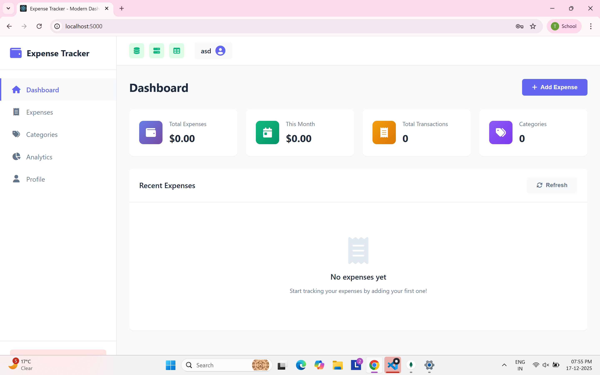

# Expense Tracker — API & Client

A production-ready Expense Tracker platform featuring a secure Express/Node.js API with MongoDB, optional PostgreSQL integration, Redis caching, WebSockets (Socket.IO), and a React client. Designed for local development, Dockerized environments, and PM2-managed deployments.

## Quick Start

- Prerequisites: Node.js 18+, npm, Docker (optional), Git
- Clone and install:
  - Backend: `npm install`
  - Frontend: `npm install --prefix client`
- Run backend (dev): `npm run dev`
- Run client (dev): `npm run client`
- Run both (dev): `npm run dev:all`
- API default URL: `http://localhost:5000`
- Client default URL: `http://localhost:3000`

## Features

- Authentication: JWT access/refresh tokens
- Datastores: MongoDB (primary), PostgreSQL (optional)
- Caching: Redis (optional, graceful fallback if not configured)
- Real-time: WebSocket updates via Socket.IO
- Security: Helmet, CORS, sanitization (xss-clean, express-mongo-sanitize), rate limiting
- Views: EJS server-rendered pages in addition to API
- Testing: Jest (unit, integration, functional); in-memory Mongo for tests
- Docker: Compose files for production and development
- Process manager: PM2 via `ecosystem.config.js`

## Screenshots

Login and registration


Dashboard views




Create flows


Analytics and profile


Data persistence


## Repository Layout

- API server entry: [server.js](server.js)
- React client app: [client](client)
- Config: [config](config) (MongoDB, PostgreSQL, Redis, HTTPS, WebSocket)
- Routes: [routes](routes)
- Controllers: [controllers](controllers)
- Models: [models](models)
- Middleware: [middleware](middleware)
- Public assets (server-rendered): [public](public)
- Views (EJS): [views](views)
- Utilities & scripts: [utils](utils)
- Docker setup: [docker](docker)
- Tests: [tests](tests)

## Project Structure

```
ExpenseTrackerAPI/
│
├── ecosystem.config.js                # PM2 process definition for production
├── jest.config.js                     # Jest configuration for tests
├── package.json                       # Backend dependencies and scripts
├── postman_collection.json            # API collection for manual testing
├── server.js                          # Express app entry (HTTP/HTTPS, Socket.IO)
├── setup.ps1                          # Windows setup helper
├── start-dev.js                       # Dev helper (if used with nodemon/concurrently)
├── start.ps1                          # Windows start helper
│
├── client/                            # React client (CRA)
│   ├── package.json                   # Client dependencies and scripts
│   ├── public/
│   │   ├── index.html                 # Client HTML template
│   │   ├── manifest.json
│   │   └── robots.txt
│   └── src/
│       ├── App.css
│       ├── App.js                     # Root React component
│       ├── App.test.js                # Client tests
│       ├── index.css
│       ├── index.js                   # Client entry
│       ├── reportWebVitals.js
│       ├── setupTests.js
│       ├── components/
│       │   ├── Dashboard.js
│       │   ├── Home.js
│       │   ├── Layout.js
│       │   ├── Login.js
│       │   ├── PrivateRoute.js
│       │   ├── Register.js
│       │   └── TopNav.js
│       ├── context/
│       │   └── AuthContext.js         # Auth state/context
│       └── utils/
│           └── api.js                 # Axios instance for API calls
│
├── config/                            # Backend configuration modules
│   ├── https.js                       # HTTP/HTTPS server factory, SSL handling
│   ├── jwt.js                         # JWT token helpers
│   ├── mongodb.js                     # MongoDB connection with retry/fail-fast
│   ├── postgres.js                    # Optional PostgreSQL pool and schema init
│   ├── redis.js                       # Optional Redis client + cache helpers
│   └── websocket.js                   # Socket.IO initialization
│
├── controllers/                       # Route handlers (business logic)
│   ├── analyticsController.js
│   ├── authController.js
│   ├── categoryController.js
│   ├── expenseController.js
│   └── viewController.js              # EJS view helpers
│
├── docker/                            # Containerization
│   ├── docker-compose.dev.yml         # Dev compose (live-reload API)
│   ├── docker-compose.replication.yml # Replication support scripts
│   ├── docker-compose.yml             # Prod-like compose (API, DBs, client)
│   ├── api/
│   │   └── Dockerfile                 # API image
│   └── client/
│       └── Dockerfile                 # Client image
│
├── middleware/                        # Express middlewares
│   ├── authenticate.js
│   ├── cache.js
│   ├── errorHandler.js
│   ├── rateLimiter.js
│   └── validator.js
│
├── models/                            # Mongoose models
│   ├── Category.js
│   ├── Expense.js
│   └── User.js
│
├── pics/                              # Screenshots for documentation
│   └── *.png
│
├── public/                            # Server-rendered static assets
│   ├── css/
│   │   └── style.css
│   └── js/
│       └── app.js
│
├── routes/                            # API and view routes
│   ├── analyticsRoutes.js
│   ├── authRoutes.js
│   ├── categoryRoutes.js
│   ├── expenseRoutes.js
│   ├── externalApiRoutes.js
│   ├── postgresRoutes.js
│   └── viewRoutes.js
│
├── tests/                             # Jest test suites
│   ├── setup.js                       # Test env bootstrap
│   ├── functional/
│   │   └── expense-workflow.test.js
│   ├── integration/
│   │   └── auth.test.js
│   └── unit/
│       └── user.test.js
│
├── utils/                             # Utilities and scripts
│   ├── categoryRoutes.js
│   ├── cli-report.js                  # CLI env/dep report
│   ├── esmExample.mjs
│   ├── externalApi.js
│   ├── generate-ssl-nodejs.js         # Local SSL generator
│   ├── generate-ssl.js
│   ├── helpers.js
│   ├── kill-port.js
│   ├── postgresSync.js
│   ├── reset-mongo.js
│   ├── setup-replication.js
│   └── test-external-api.js
│
└── views/                             # EJS templates for server-rendered pages
  └── index.ejs
```

## Environment Variables

Create a `.env` file at the project root as needed. Common variables:

- `PORT`: API port (default `5000`)
- `CORS_ORIGIN`: Allowed origin for CORS (default `http://localhost:3000`)
- `ENABLE_HTTPS`: `true|false` to serve HTTPS if certs exist (default `false`)

Authentication
- `JWT_SECRET`: Access token secret
- `JWT_EXPIRE`: Access token TTL (e.g., `7d`)
- `JWT_REFRESH_SECRET`: Refresh token secret
- `JWT_REFRESH_EXPIRE`: Refresh token TTL (e.g., `30d`)

MongoDB
- `MONGODB_URI`: e.g., `mongodb://localhost:27017/expense_tracker`
- `MONGODB_REQUIRED`: `true|false` fail-fast if unavailable (default `false`)
- `MONGODB_CONNECT_TIMEOUT_MS`: connect timeout (ms)
- `MONGODB_RETRY_MS`: background retry interval (ms)

PostgreSQL (optional)
- `POSTGRES_HOST`, `POSTGRES_PORT`, `POSTGRES_USER`, `POSTGRES_PASSWORD`, `POSTGRES_DB`

Redis (optional)
- `REDIS_URL` or (`REDIS_HOST`, `REDIS_PORT`, `REDIS_PASSWORD`, `REDIS_DB`)

## Scripts

Backend scripts from [package.json](package.json):

- `start`: Start API (`node server.js`)
- `start:https`: Start API with HTTPS if `ENABLE_HTTPS=true`
- `dev`: Start API in dev with `nodemon`
- `client`: Start React client
- `dev:all`: Run API and client together (via `concurrently`)
- `generate:ssl`: Self-generate local certs into `ssl/`
- `cli:report`: Print environment & dependency report
- Tests
  - `test`, `test:unit`, `test:integration`, `test:functional`, `test:coverage`, `test:watch`
- Utilities
  - `db:reset:mongo`: Reset local Mongo DB
  - `test:api`: Exercise external API utility
  - `test:esm`: ES module example

Client scripts from [client/package.json](client/package.json):

- `start`, `build`, `test`, `eject`

## Running Locally

1) Install dependencies

```bash
npm install
npm install --prefix client
```

2) (Optional) Create `.env` and set secrets and DB connection strings.

3) Start API (dev)

```bash
npm run dev
```

4) Start Client (dev)

```bash
npm run client
```

5) Open
- API: http://localhost:5000/health
- Client: http://localhost:3000

### HTTPS (local)

```bash
npm run generate:ssl
# then
npm run start:https
```

## Docker

Production-like compose: [docker/docker-compose.yml](docker/docker-compose.yml)

```bash
cd docker
docker compose up --build -d
```

Development compose (live-reload API): [docker/docker-compose.dev.yml](docker/docker-compose.dev.yml)

```bash
cd docker
docker compose -f docker-compose.dev.yml up --build
```

Services
- `app`: API (Express, Socket.IO)
- `client`: React app
- `mongodb`: MongoDB 7
- `postgres`: PostgreSQL 14 (optional features)

Use environment overrides via a `.env` file or compose env vars.

## API Overview

Base URL: `http://localhost:5000/api`

Key route groups
- `POST /auth/register` — create user
- `POST /auth/login` — obtain tokens
- `POST /auth/refresh` — rotate access token
- `GET /expenses` / `POST /expenses` / `PATCH /expenses/:id` / `DELETE /expenses/:id`
- `GET /categories` / `POST /categories` / `PATCH /categories/:id` / `DELETE /categories/:id`
- `GET /analytics/...` — spending summaries and trends
- `GET /external/...` — example external API usage
- `GET /postgres/...` — optional relational endpoints (enabled when PostgreSQL configured)

Explore the full request collection: [postman_collection.json](postman_collection.json)

## WebSocket Events

- Connect to the same origin as the API (port `5000` by default)
- Join per-user room: `join` with your `userId`
- Server emits real-time notifications to `user_${userId}` rooms

Example (client-side):

```js
import { io } from 'socket.io-client';
const socket = io('http://localhost:5000');
socket.on('connect', () => {
  socket.emit('join', userId);
});
```

## Testing

- All tests:

```bash
npm test
```

- Specific suites:

```bash
npm run test:unit
npm run test:integration
npm run test:functional
npm run test:coverage
```

The test setup uses `mongodb-memory-server` for reliable, isolated runs.

## Production

PM2 with [ecosystem.config.js](ecosystem.config.js):

```bash
# Install pm2 globally if needed
npm i -g pm2

pm2 start ecosystem.config.js
pm2 status
pm2 logs expense-tracker-api
```

Recommended
- Provide strong `JWT_*` secrets via environment
- Configure `CORS_ORIGIN`
- Use managed MongoDB/Redis/PostgreSQL services or secure self-hosted instances
- Enable HTTPS and terminate TLS at a reverse proxy (e.g., NGINX) in production

## Troubleshooting

- Port in use: adjust `PORT` or stop the conflicting process
- MongoDB down: set `MONGODB_REQUIRED=true` to fail-fast; otherwise the API will keep retrying
- Redis/PostgreSQL optional: the API logs a skip notice when not configured

Helpful scripts

```bash
npm run cli:report
npm run db:reset:mongo
```

## License

ISC — see [package.json](package.json)

---

Maintained by the Expense Tracker team. Contributions welcome via pull requests.

## 👨‍💻 About the Developer

**Taranjot Singh**
- 💼 LinkedIn: https://www.linkedin.com/in/taranjot13
- 📧 Email: 65taranjot@gmail.com
- 🐙 GitHub: https://github.com/Taranjot13

## 📞 Contact

For any questions or feedback, please reach out:
- Email: 65taranjot@gmail.com
- LinkedIn: https://www.linkedin.com/in/taranjot13
- Project Link: https://github.com/Taranjot13/smart-task-scheduler

---

⭐ If you found this project helpful, please give it a star on GitHub!

**Built with ❤️ and ☕ by Taranjot Singh**